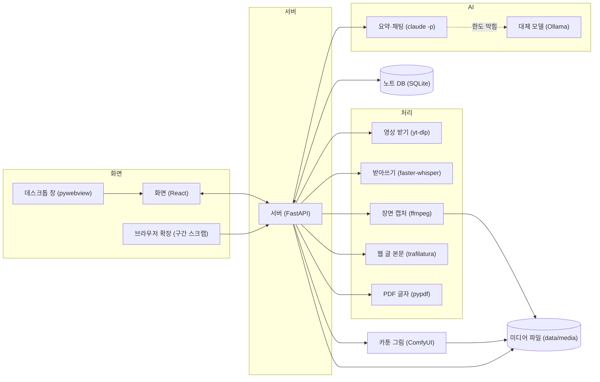
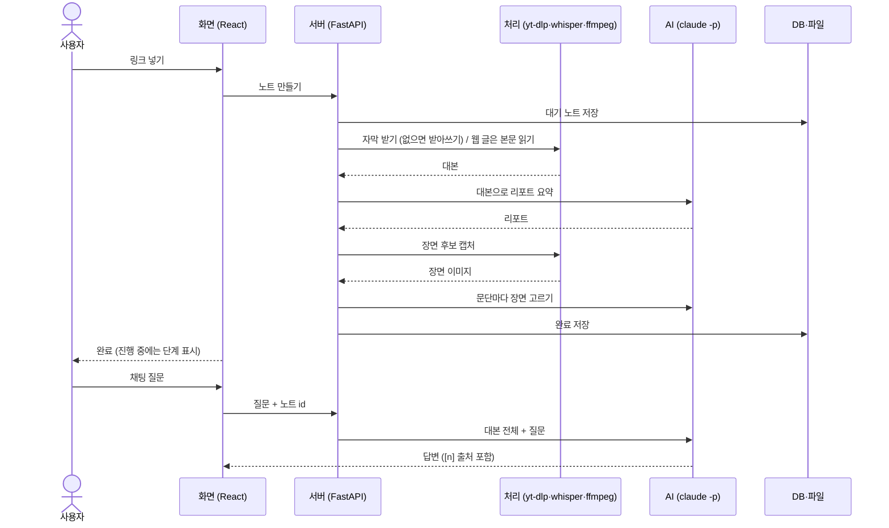
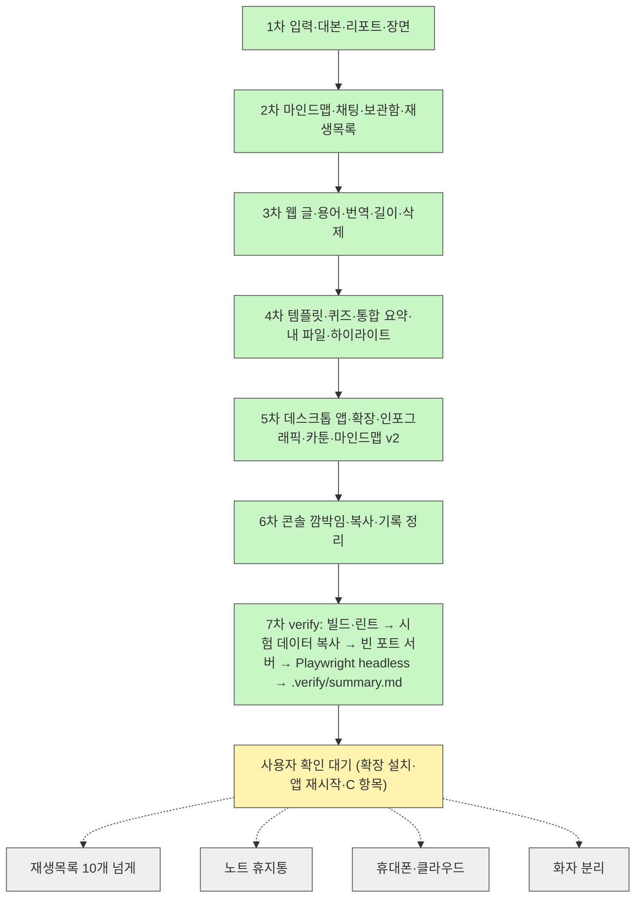

# ARCHITECTURE — 영상노트 구조도

보는 법: VS Code에 확장 「Markdown Preview Mermaid Support」(무료)를 설치하고 이 파일을 연 뒤 `Ctrl+Shift+V`. 파일이 바뀌면 그림도 자동 갱신된다.

## 전체 구조

```mermaid
flowchart LR
  subgraph 화면
    창["데스크톱 창 (pywebview)"]
    웹["화면 (React)"]
    확장["브라우저 확장 (구간 스크랩)"]
  end
  subgraph 서버
    API["서버 (FastAPI)"]
  end
  subgraph 처리
    다운["영상 받기 (yt-dlp)"]
    받아쓰기["받아쓰기 (faster-whisper)"]
    장면["장면 캡처 (ffmpeg)"]
    본문["웹 글 본문 (trafilatura)"]
    문서["PDF 글자 (pypdf)"]
  end
  subgraph AI
    클로드["요약·채팅 (claude -p)"]
    올라마["대체 모델 (Ollama)"]
  end
  카툰["카툰 그림 (ComfyUI)"]
  DB[("노트 DB (SQLite)")]
  파일[("미디어 파일 (data/media)")]
  창 --> 웹
  웹 <--> API
  확장 --> API
  API <--> DB
  API --> 다운
  API --> 받아쓰기
  API --> 장면
  API --> 본문
  API --> 문서
  API --> 클로드
  클로드 -.한도 막힘.-> 올라마
  API --> 카툰
  장면 --> 파일
  카툰 --> 파일
  API --> 파일
```

## 주요 흐름

```mermaid
sequenceDiagram
  actor 사용자
  participant 화면 as 화면 (React)
  participant 서버 as 서버 (FastAPI)
  participant 처리 as 처리 (yt-dlp·whisper·ffmpeg)
  participant AI as AI (claude -p)
  participant 저장 as DB·파일
  사용자->>화면: 링크 넣기
  화면->>서버: 노트 만들기
  서버->>저장: 대기 노트 저장
  서버->>처리: 자막 받기 (없으면 받아쓰기) / 웹 글은 본문 읽기
  처리-->>서버: 대본
  서버->>AI: 대본으로 리포트 요약
  AI-->>서버: 리포트
  서버->>처리: 장면 후보 캡처
  처리-->>서버: 장면 이미지
  서버->>AI: 문단마다 장면 고르기
  서버->>저장: 완료 저장
  화면-->>사용자: 완료 (진행 중에는 단계 표시)
  사용자->>화면: 채팅 질문
  화면->>서버: 질문 + 노트 id
  서버->>AI: 대본 전체 + 질문
  AI-->>화면: 답변 ([n] 출처 포함)
```

## 작업 진행 상태

```mermaid
flowchart TD
  P1["1차 입력·대본·리포트·장면"]:::done
  P2["2차 마인드맵·채팅·보관함·재생목록"]:::done
  P3["3차 웹 글·용어·번역·길이·삭제"]:::done
  P4["4차 템플릿·퀴즈·통합 요약·내 파일·하이라이트"]:::done
  P5["5차 데스크톱 앱·확장·인포그래픽·카툰·마인드맵 v2"]:::done
  P6["6차 콘솔 깜박임·복사·기록 정리"]:::done
  P7["7차 verify: 빌드·린트 → 시험 데이터 복사 → 빈 포트 서버 → Playwright headless → .verify/summary.md"]:::done
  U["사용자 확인 대기 (확장 설치·앱 재시작·C 항목)"]:::doing
  Q1["재생목록 10개 넘게"]:::later
  Q2["노트 휴지통"]:::later
  Q3["휴대폰·클라우드"]:::later
  Q4["화자 분리"]:::later
  P1 --> P2 --> P3 --> P4 --> P5 --> P6 --> P7 --> U
  U -.-> Q1
  U -.-> Q2
  U -.-> Q3
  U -.-> Q4
  classDef done fill:#c8f7c5,stroke:#555
  classDef doing fill:#fff3b0,stroke:#555
  classDef later fill:#eee,stroke:#555
```
